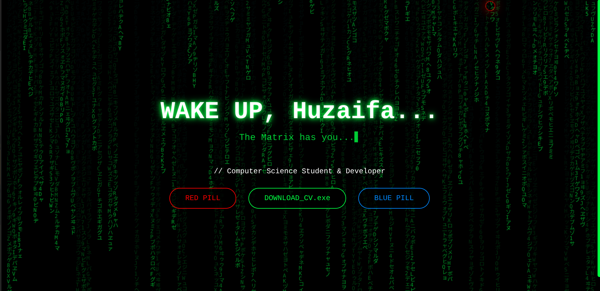
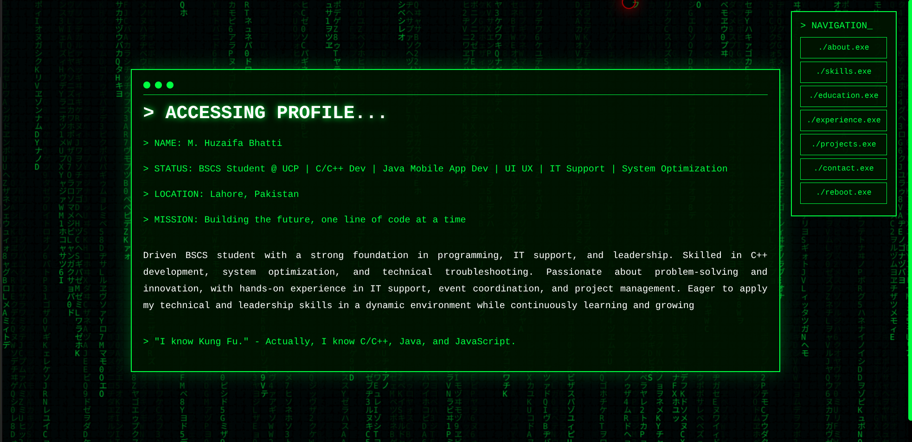
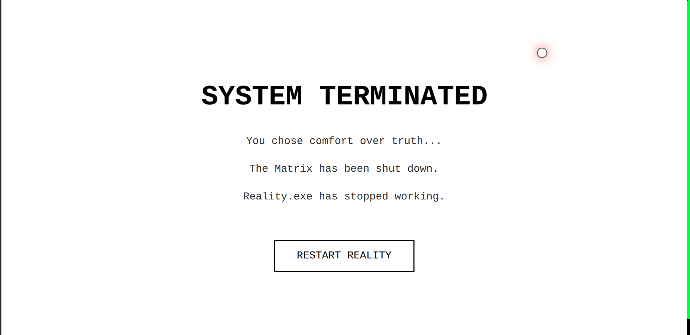

# 🌐 Matrix-Themed Portfolio Website

A futuristic, interactive portfolio website inspired by *The Matrix* movie. Features dynamic animations, glitch effects, and an immersive cyberpunk aesthetic.

   

## 🎯 Live Demo

[**View Live Demo**](#)https://mhrbhatti.netlify.app/

## ✨ Features

### 🎨 Visual Effects
- **Matrix Rain Animation** - Iconic falling green characters background
- **Interactive Mouse Effects** - Custom cursor glow, particle trails, and click ripples
- **Glitch Animations** - Cyberpunk-style text and button effects
- **Blue Pill Easter Egg** - Choose the blue pill for a system crash sequence

### 📱 Sections
- **About** - Professional introduction and background
- **Skills** - Animated skill bars with proficiency levels
- **Education** - Academic credentials and certifications
- **Experience** - Professional work history
- **Projects** - Portfolio of development projects
- **Contact** - Social media and professional links

### 🎮 Interactive Elements
- **Red Pill / Blue Pill Choice** - Interactive entry point
- **Terminal-Style Navigation** - Cyberpunk command-line interface
- **Downloadable CV** - One-click resume download
- **System Reboot Effect** - Glitch reassembly animation
- **Right-Click Protection** - Security alert on unauthorized access

## 🚀 Technologies Used

- **HTML5** - Structure and semantic markup
- **CSS3** - Styling, animations, and responsive design
- **Vanilla JavaScript** - Interactive features and canvas animations
- **Canvas API** - Matrix rain background effect

## 📦 Installation & Setup

### Prerequisites
- A modern web browser (Chrome, Firefox, Safari, Edge)
- A text editor (VS Code, Sublime Text, etc.)

### Local Setup

1. **Clone the repository**
```bash
   git clone https://github.com/yourusername/matrix-portfolio.git
   cd matrix-portfolio
```

2. **Add your CV**
   - Place your CV file as `Resume_HuzaifaBhatti_CS.pdf` in the root directory
   - Or update the filename in `script.js`:
```javascript
   function downloadCV() {
       window.open("your-cv-filename.pdf", "_blank");
   }
```

3. **Customize content**
   - Edit `index.html` to update personal information
   - Modify projects, skills, and experience sections
   - Update social media links in the contact section

4. **Open in browser**
```bash
   # Simply open index.html in your browser
   # Or use a local server:
   python -m http.server 8000
   # Then navigate to http://localhost:8000
```

## 🎨 Customization Guide

### Change Colors
Edit `style.css` to modify the color scheme:
```css
/* Primary green color */
#00FF41 → Your color

/* Red accents */
#FF0000 → Your color

/* Blue pill color */
#0088FF → Your color
```

### Update Personal Information
Edit `index.html`:
- Line 23: Change name in intro
- Line 35-42: Update About section
- Line 56-81: Modify Skills section
- Line 89-135: Edit Education section
- Line 143-169: Update Experience section
- Line 198-204: Change Contact links

### Modify Mouse Effects
In `script.js`, adjust:
```javascript
// Trail speed (line 92)
trailTimeout = setTimeout(() => {...}, 50); // Change 50 to adjust speed

// Particle count (line 104)
for (let i = 0; i < 12; i++) {...} // Change 12 for more/fewer particles
```

## 📂 Project Structure
```
matrix-portfolio/
│
├── index.html              # Main HTML file
├── style.css               # All styling and animations
├── script.js               # JavaScript functionality
├── Resume_HuzaifaBhatti_CS.pdf  # Your CV (add this)
└── README.md               # This file
```

## 🎯 Key Features Breakdown

### Matrix Rain Effect
- Canvas-based animation with Japanese characters and alphanumeric symbols
- Configurable speed and density
- Optimized for performance

### Blue Pill Sequence
1. Screen glitch effect (1s)
2. Color distortion (1s)
3. Matrix breakdown with rainbow code (1s)
4. White screen transition (0.5s)
5. System terminated message
6. Memory purge on restart
7. Glitch reassembly animation

### Mouse Interactions
- **Cursor Glow** - Pulsing red ring follows cursor
- **Character Trail** - Random Matrix characters fade behind mouse
- **Click Ripple** - Expanding circles on click
- **Particle Burst** - 12 particles shoot out on click

## 🌐 Browser Compatibility

| Browser | Version | Status |
|---------|---------|--------|
| Chrome  | 90+     | ✅ Full Support |
| Firefox | 88+     | ✅ Full Support |
| Safari  | 14+     | ✅ Full Support |
| Edge    | 90+     | ✅ Full Support |

## 📱 Responsive Design

- **Desktop** (1200px+) - Full featured experience
- **Tablet** (768px - 1199px) - Optimized layout
- **Mobile** (< 768px) - Stacked sections, touch-optimized

## 🔒 Security Features

- Right-click context menu disabled
- Alert on unauthorized access attempts
- No external dependencies (security through simplicity)

## 🎓 Learning Resources

If you're building something similar, check out:
- [Canvas API Documentation](https://developer.mozilla.org/en-US/docs/Web/API/Canvas_API)
- [CSS Animations Guide](https://developer.mozilla.org/en-US/docs/Web/CSS/CSS_Animations)
- [JavaScript Event Handling](https://developer.mozilla.org/en-US/docs/Web/Events)

## 🤝 Contributing

Contributions are welcome! If you have suggestions:

1. Fork the repository
2. Create a feature branch (`git checkout -b feature/AmazingFeature`)
3. Commit your changes (`git commit -m 'Add some AmazingFeature'`)
4. Push to the branch (`git push origin feature/AmazingFeature`)
5. Open a Pull Request

## 📝 License

This project is licensed under the MIT License - see the [LICENSE](LICENSE) file for details.

## 👤 Author

**M. Huzaifa Bhatti**
- GitHub: [@yourusername](https://github.com/yourusername)
- LinkedIn: [mhrbhatti](https://linkedin.com/in/mhrbhatti)
- Email: bhattihuzaifa3@gmail.com
- Instagram: [@mhrbhatti](https://instagram.com/mhrbhatti)

## 🙏 Acknowledgments

- Inspired by *The Matrix* film series
- Matrix rain effect concept from the original movie
- Thanks to the web development community for inspiration

## 📸 Screenshots

### Landing Page

*Red pill / Blue pill choice with Matrix rain*

### About Section

*Terminal-style profile information*

### Blue Pill Effect

*System crash sequence*

---

### 🚀 Quick Start Commands
```bash
# Clone the repo
git clone https://github.com/yourusername/matrix-portfolio.git

# Navigate to directory
cd matrix-portfolio

# Open in browser
open index.html
# OR
python -m http.server 8000
```

---

**⭐ If you like this project, please give it a star on GitHub!**

Made with ❤️ and lots of ☕ by Huzaifa Bhatti
```

---

## 📄 Additional Files to Add

### **LICENSE** (MIT License)
```
MIT License

Copyright (c) 2025 M. Huzaifa Bhatti

Permission is hereby granted, free of charge, to any person obtaining a copy
of this software and associated documentation files (the "Software"), to deal
in the Software without restriction, including without limitation the rights
to use, copy, modify, merge, publish, distribute, sublicense, and/or sell
copies of the Software, and to permit persons to whom the Software is
furnished to do so, subject to the following conditions:

The above copyright notice and this permission notice shall be included in all
copies or substantial portions of the Software.

THE SOFTWARE IS PROVIDED "AS IS", WITHOUT WARRANTY OF ANY KIND, EXPRESS OR
IMPLIED, INCLUDING BUT NOT LIMITED TO THE WARRANTIES OF MERCHANTABILITY,
FITNESS FOR A PARTICULAR PURPOSE AND NONINFRINGEMENT. IN NO EVENT SHALL THE
AUTHORS OR COPYRIGHT HOLDERS BE LIABLE FOR ANY CLAIM, DAMAGES OR OTHER
LIABILITY, WHETHER IN AN ACTION OF CONTRACT, TORT OR OTHERWISE, ARISING FROM,
OUT OF OR IN CONNECTION WITH THE SOFTWARE OR THE USE OR OTHER DEALINGS IN THE
SOFTWARE.
```

### **.gitignore**
```
# System files
.DS_Store
Thumbs.db

# Editor files
.vscode/
.idea/
*.swp
*.swo
*~

# Personal files (optional)
Resume_*.pdf
cv.pdf

# Logs
*.log

# Dependencies (if you add any later)
node_modules/
